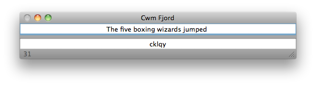

# Cwm Fjord

Cwm Fjord is a tiny Mac app that helps you write short pangrams by telling you both how many characters you've used and which letters you still need to include to make a pangram, all while you type.

You can download the latest release [here](https://github.com/fletom/Cwm-Fjord/releases/latest).

## Pangrams

[Pangrams](http://en.wikipedia.org/wiki/Pangram) are sentences that use each letter the alphabet at least once, and are typically written with the aim of using as few total characters as possible while still making some kind of sense. They are difficult to write, but very satisfying.

Examples include:

- Cwm fjord bank glyphs vext quiz.
- The quick brown fox jumped over the lazy dog.
- The five boxing wizards jumped quickly.

See http://en.wikipedia.org/wiki/List_of_pangrams for a large list of pangrams.